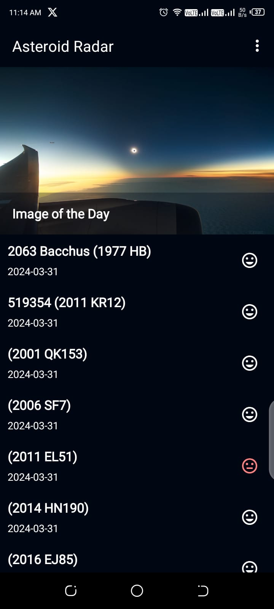
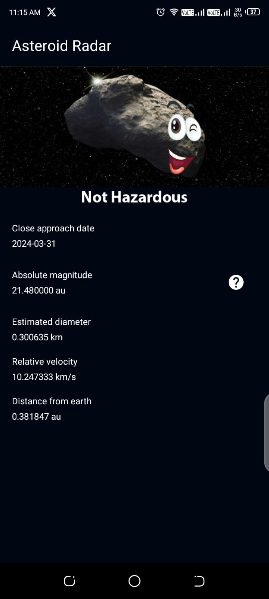
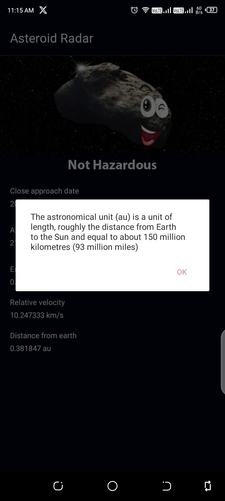
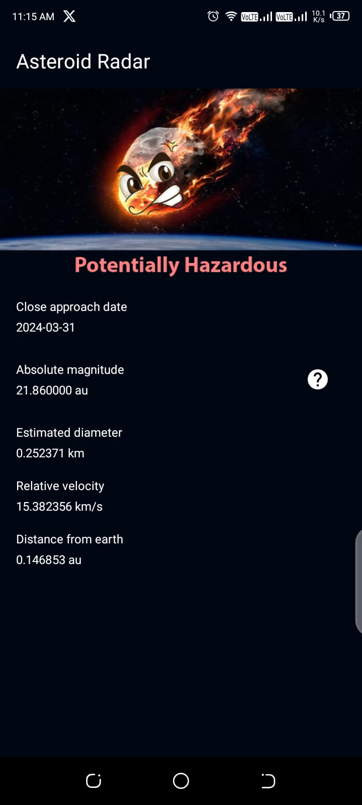

# Asteroid-Radar-App
> Project 2: Android Kotlin Developer Udacity | Nanodegree

### Rationale
> The App is inspired by The [Android Kotlin Developer Nanodegree Course](https://www.udacity.com/enrollment/nd940/2.0.9) on Udacity.
> It's the [Second](https://github.com/udacity/nd940-android-kotlin-c2-starter/tree/master/starter) of the four projects in the course.

### Tools, Libraries and Frameworks
* [Data Binding](https://developer.android.com/topic/libraries/data-binding) - a support library that allows you to bind UI components in your layouts to data sources in your app using a declarative format rather than programmatically.
* [Navigation](https://developer.android.com/jetpack/androidx/releases/navigation) - a framework for navigating between 'destinations' within an Android application
* [ViewModel](https://developer.android.com/topic/libraries/architecture/viewmodel) -  is a business logic or screen level state holder. It exposes state to the UI and encapsulates related business logic. Its principal advantage is that it caches state and persists it through configuration changes.
* [LiveData](https://developer.android.com/topic/libraries/architecture/livedata) - an observable data holder class. Unlike a regular observable, LiveData is lifecycle-aware, meaning it respects the lifecycle of other app components, such as activities, fragments, or services.
* [WorkManager](https://developer.android.com/develop/background-work/background-tasks/persistent/getting-started) - great API for background processing
* [Repository](https://developer.android.com/topic/architecture/data-layer#:~:text=Repositories%20combine%20different%20data%20sources,have%20different%20sources%20of%20truth.) - Combines different data sources and solve any potential conflicts between the data sources to update the single source of truth regularly or due to a user input event.
* [MVVM Architecture](https://www.digitalocean.com/community/tutorials/android-mvvm-design-pattern) 
* [Retrofit](https://square.github.io/retrofit/) - A type-safe HTTP client for Android and Java. Introduction. Retrofit turns your HTTP API into a Java interface.
* [Moshi](https://github.com/square/moshi) -   A modern JSON library for Android, Java and Kotlin. It makes it easy to parse JSON into Java and Kotlin classes:
* [Glide](https://github.com/bumptech/glide) - An image loading and caching library for Android focused on smooth scrolling
* [Picasso](https://square.github.io/picasso/) - A powerful image downloading and caching library for Android

### Screenshots
|  |  |
|:-----------------------------------------:|:-----------------------------------------:|
|  |  |
